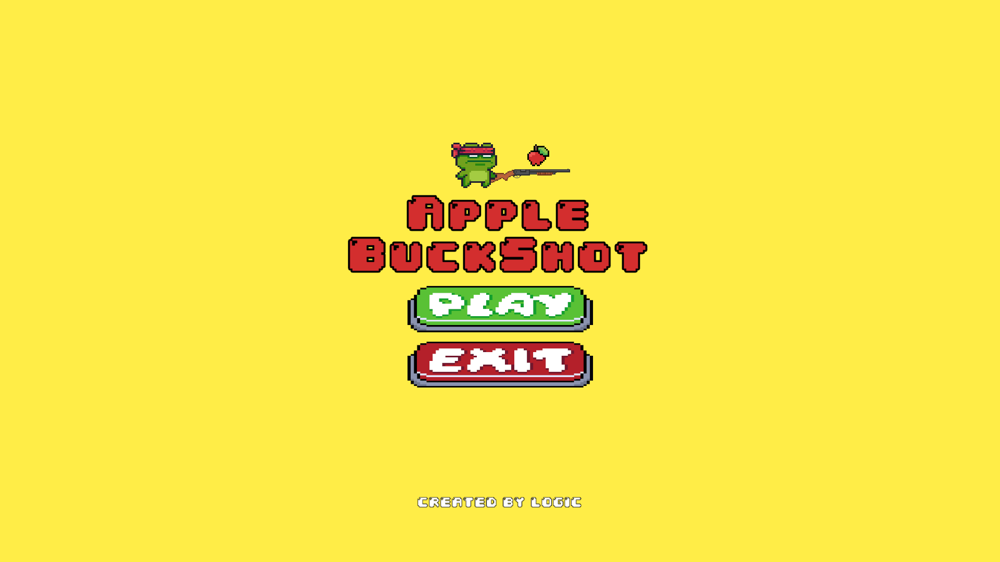
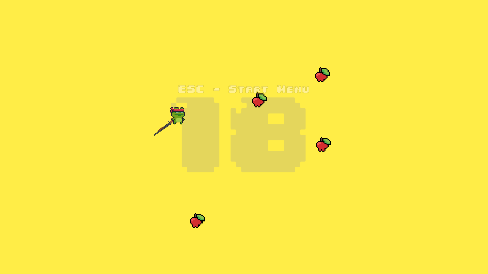
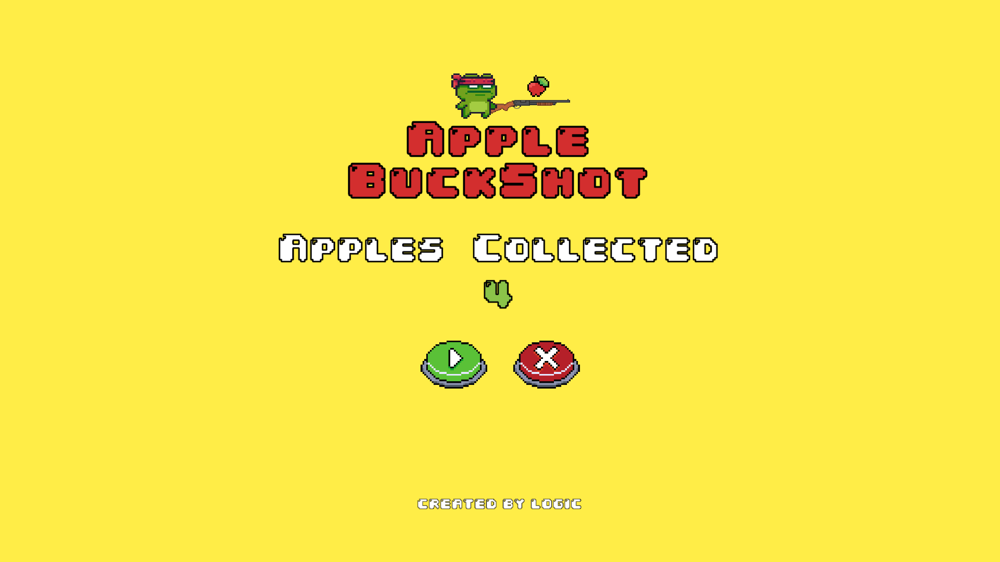

# 🍏 **Apple BuckShot** 🍏

Welcome to **Apple BuckShot** – a thrilling 2D shooter where your goal is to collect apples using your gun's recoil! 🎯🍎



## 🎮 **Gameplay Features**
- **Apple Spawner**: 🍏 Apples appear randomly. Collect as many as you can!
- **Gun Recoil**: 🔫 Use recoil to move and shoot. Manage it wisely for mobility!
- **Recoil Jumping**: 🚀 Master recoil to dodge obstacles and move across the screen.
- **Apple Bullets**: 🍏 Your ammo is apples! Keep your supply up by collecting them.
- **Seamless Transition**: 🌀 Wrap around the screen edges seamlessly.

## ⚙️ **How to Play**
| **Action**           | **Control**              |
|----------------------|--------------------------|
| Aim the gun          | Move the Mouse           |
| Fire and recoil jump | Left-Click               |
| Collect apples       | Run into them            |
| Pause the game       | Press **ESC**            |
- **Apple Ammo**: Collect apples to keep firing. Run out and the game resets after a short time. 🕰️





## 🛠️ **Core Systems**
- **Apple Spawner**: Randomly spawns apples around you. 🍏
- **Gun Recoil Jump**: Fire apples with recoil. Manage timing carefully. 🔫
- **Pause/Resume**: Pause to check stats, resume to continue. 🛑▶️
- **Screen Offset**: Wrap around edges to avoid falling off. 🌍

## 💻 **Installation & Play**
1. Clone the repository:
   ```bash
   git clone https://github.com/0xlog1c/apple-buckshot.git
   ```
2. Open in Unity and hit **Play**! 🎮

## ✨ **Credits**
- **Game Assets**: 
    - [Shotgun Asset](arcadeisland.itch.io/guns-asset-pack-v1)
    - [Frog Ninja](pixelfrog-assets.itch.io/pixel-adventure-1)
    - [UI](npkuu.itch.io/pixelgui)
- **Sound Effects**: YouTube 🎥
---
Have fun collecting apples and mastering the recoil! 🍏🔫